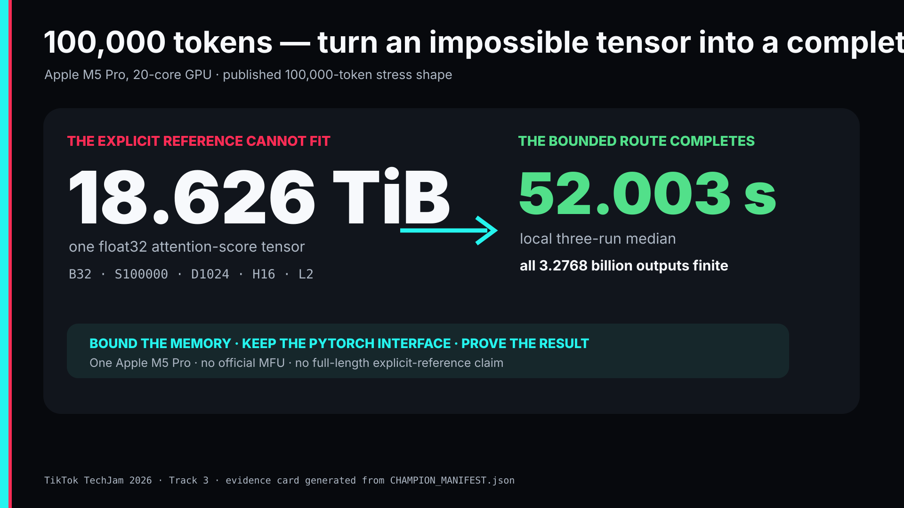
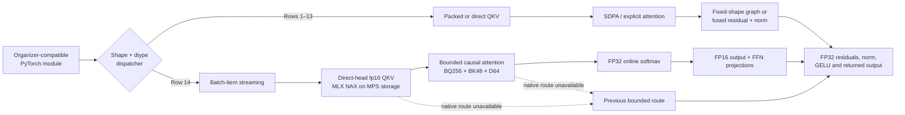
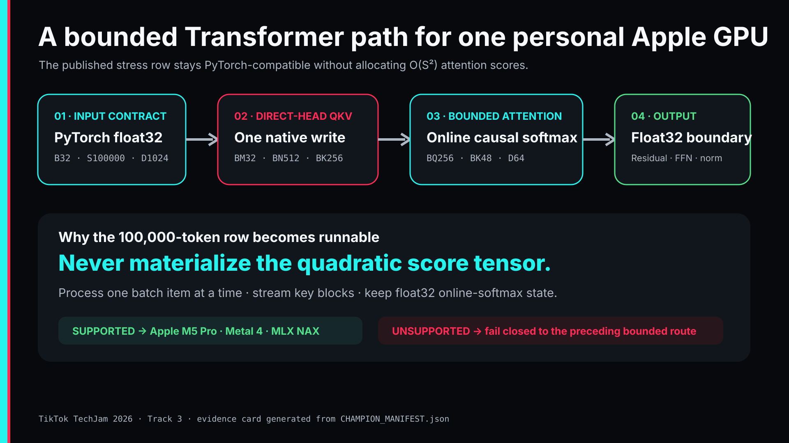
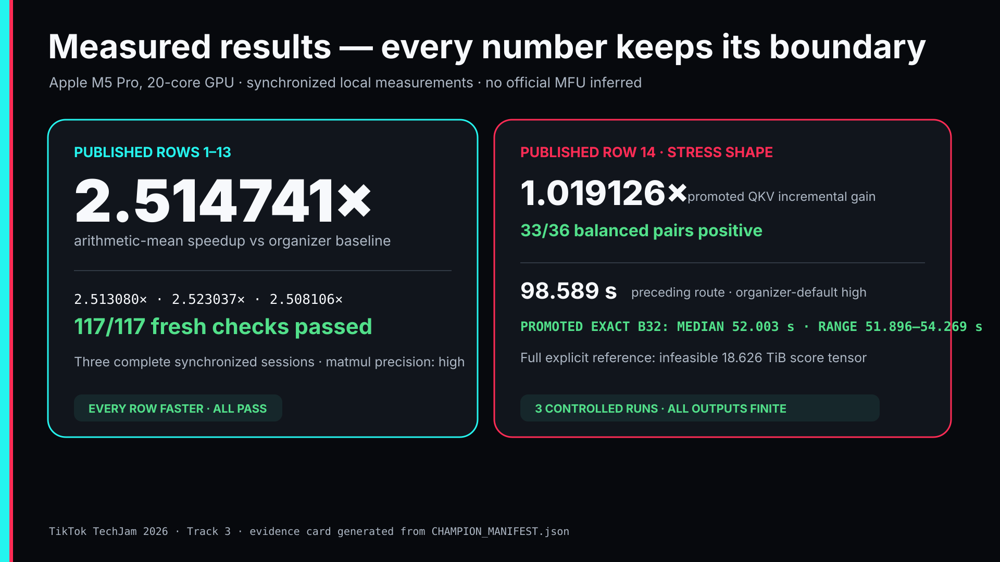
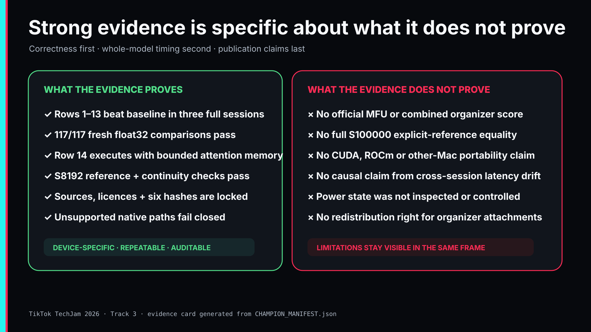

<h1 align="center">M5 LongContext</h1>

<p align="center">
  <strong>Exact 100,000-token causal Transformer execution on one Apple M5 Pro</strong><br>
  A PyTorch-compatible, memory-bounded Metal 4 implementation for TikTok TechJam 2026 Track 3.
</p>

<p align="center">
  <a href="https://www.youtube.com/watch?v=f_fBUv4fHEs">3-minute demo</a>
  ·
  <a href="https://devpost.com/software/m5-longcontext-100k-token-transformer-on-apple-silicon">Devpost submission</a>
  ·
  <a href="TECHNICAL_REPORT.md">technical report</a>
  ·
  <a href="docs/CHAMPION_MANIFEST.json">machine-readable result</a>
</p>

<p align="center">
  <a href="https://www.youtube.com/watch?v=f_fBUv4fHEs">
    
  </a>
</p>

## The 60-second version

The organizer's largest published Transformer case has batch size 32, sequence
length 100,000, model width 1,024, 16 attention heads and two layers. A single
explicit float32 attention-score tensor for that case would occupy **18.626
TiB**—roughly 298 times the declared machine's 64 GB of unified memory. The
reference formulation is therefore not merely slow on this computer; it is
physically impossible to allocate.

M5 LongContext preserves the organizer's PyTorch parameter names and output
contract, but replaces the quadratic long-sequence attention allocation with a
bounded, tiled, online-softmax route on Metal 4. It uses Apple MLX NAX building
blocks directly on PyTorch MPS storage, keeps numerically sensitive state in
float32, and fails closed to a preceding bounded implementation if the native
route is unavailable.

| Question | Answer |
|---|---|
| What changed? | Shape- and dtype-aware dispatch, packed/direct-head QKV, safe internal fp16 boundaries, bounded NAX attention, fixed-shape graphs and small fused Metal operations. |
| What stayed compatible? | The organizer's configuration, parameter names, strict weight copy, float32 input/output boundary and correctness predicate. |
| Rows 1–13 | **2.514741× arithmetic-mean speedup** over three complete organizer-default `high` sessions; **117/117** fresh float32 checks passed. |
| Row 14 | Exact published `B=32, S=100000` execution completed three times in `54.269`, `51.896` and `52.003` seconds; **52.003 s median**; all 3.2768 billion outputs finite. |
| Result machine | MacBook Pro, Apple M5 Pro, 18-core CPU, 20-core GPU, 64 GB unified memory, macOS 26.6.2. |
| Claim boundary | Local device-specific evidence—not an official MFU, combined organizer score, CUDA result or full-length explicit-reference equality claim. |

### Choose your path

- **Judge or reviewer:** watch the [three-minute demonstration](https://www.youtube.com/watch?v=f_fBUv4fHEs), read [Measured results](#measured-results), then inspect the [evidence map](#evidence-map).
- **Engineer:** start with [Architecture](#architecture), [Correctness contract](#correctness-contract) and [Setup](#setup).
- **Reproducer:** follow [Verification tiers](#verification-tiers) before running any long-sequence workload.
- **AI agent:** read [Agent handoff contract](#agent-handoff-contract) before editing, benchmarking or making claims.

## Why the published stress case is different

For explicit multi-head attention, the score tensor contains
`batch × heads × sequence × sequence` float32 elements:

```text
32 × 16 × 100,000 × 100,000 × 4 bytes
= 20,480,000,000,000 bytes
= 18.626 TiB
```

That is for **one score tensor**, before accounting for Q/K/V, probabilities,
activations, parameters or allocator overhead. Reducing ordinary constant
factors cannot solve this. The long-sequence route must avoid materializing the
`S × S` matrix.

This observation shaped three non-negotiable design goals:

1. **Bound memory:** process compact causal tiles and maintain online-softmax
   state instead of storing all pairwise scores.
2. **Preserve the contract:** remain a drop-in PyTorch module with the
   organizer's parameter names and strict state-dict copy behavior.
3. **Keep evidence honest:** report only measurements and correctness checks
   that actually ran on the declared machine.

## Architecture



<p align="center">
  
</p>

### Ordinary published rows: 1–13

The dispatcher does not force one optimization onto every shape. It selects
only routes that passed their own correctness and whole-model timing gates:

- packed Q/K/V projection where packing won; separate projections where it did
  not;
- PyTorch scaled-dot-product attention for compatible float32 shapes, with the
  organizer's explicit arithmetic retained for half dtypes where SDPA failed;
- narrow internal fp16 projection/attention boundaries on exact measured
  shapes, immediately converted back to float32;
- lazily traced and frozen fixed-shape graphs for cases 2, 3, 9 and 12; and
- adapted Metal residual-plus-LayerNorm kernels for measured all-valid routes.

### Published stress row: 14

The retained long-context route is intentionally more specialized:

1. Process one batch item at a time to bound live activation memory.
2. Use a Metal 4 `BM32/BN512/BK256/WM1/WN8` NAX projection that writes all 48
   head-major Q/K/V tensors directly, avoiding a separate layout materialization.
3. Pad only Q by 96 rows so 100,000 tokens map to complete `BQ256` query tiles;
   keep K/V at their true length and discard padded outputs.
4. Stream causal `BQ256/BK48/BD64/WM16/WN1` attention tiles. The full score
   matrix never exists.
5. Keep online-softmax maximum, denominator and accumulation in float32.
6. Return dense projection results immediately to float32; keep residuals,
   LayerNorm, GELU and the public output in float32.
7. If Metal 4 compilation, NAX dispatch, shape, stride or mask requirements are
   not satisfied, fall back to the preceding bounded route—never to an unsafe
   quadratic allocation.

The exact implementation entry point is
[`solution/optimized_transformer.py`](solution/optimized_transformer.py).
Native bridges live in
[`solution/mps_metal4_qkv_head_layout.mm`](solution/mps_metal4_qkv_head_layout.mm)
and [`solution/mps_metal4_attention.mm`](solution/mps_metal4_attention.mm).

## Measured results

All numbers below are synchronized local measurements on the declared Apple
M5 Pro. Compilation and first launch are outside the measured interval, as
allowed by the workshop clarification. These two result rows have different
comparison boundaries and must not be combined into an invented suite score.

| Published rows | Current evidence |
|---|---|
| **1–13** | Three organizer-default `high` sessions measured `2.513080×`, `2.523037×` and `2.508106×` versus the explicit organizer baseline. Arithmetic mean: **2.514741×**; geometric mean: `2.514733×`; max/min spread: `0.595334%`. All **117/117** fresh float32 comparisons passed. |
| **14** | The preceding safe route completed the exact `(B=32,S=100000,D=1024,H=16,F=1024,L=2)` execution in `69.605`, `97.173`, and `131.088` seconds, plus an explicit-`high` point at `98.589` seconds; every returned value was finite. The promoted direct-head QKV route measured `1.019126x` over that preceding projection route in four balanced `B=1,S=100000` sessions. Its three contention-controlled exact `B=32` runs were `54.269, 51.896, 52.003` seconds (median `52.003` seconds, range `51.896`–`54.269`), with every output finite. Power state was not inspected or used as a gate. |

<p align="center">
  
</p>

### How the timings were protected from false wins

- synchronize MPS at every host timing boundary;
- warm up before measuring;
- hold seed, input and weights fixed within a comparison;
- alternate baseline/candidate order in the same session;
- require correctness before timing;
- promote only repeated whole-model improvements, not isolated kernel wins;
- retain rejected and sign-reversing candidates in the experiment record; and
- for the final row-14 set, require a 60-second clean monitored-process window,
  poll once per second, keep all three timings, and reject max/min spread above
  `1.15`.

No official MFU or combined organizer score is claimed because the organizer's
numerical MFU formula, row weights and an authoritative Apple peak-fp32
denominator were not available.

## Correctness contract

The organizer predicate accepts an element when:

```text
absolute_error <= 0.002
OR
absolute_error <= 0.02 × absolute_reference
```

Output shape must also match. Rows 1–13 are checked directly against the
explicit organizer implementation. Their current fresh float32 matrix passed
117/117 comparisons; an additional 39/39 case/dtype matrix across float32,
float16 and bfloat16 also passed at the retained checkpoint.

A full explicit row-14 reference cannot be allocated on this machine. Its
evidence is deliberately separated:

- explicit organizer-reference comparisons at `S=8192`, including prefix-mask
  and batch-indexing checks;
- larger/full-length continuity comparisons against the previously validated
  bounded champion;
- exact `B=32,S=100000` executions with all 3,276,800,000 returned values
  finite; and
- safe fallback and dispatch-boundary tests.

This is strong evidence for the bounded route. It is **not** represented as
full-length equality with an explicit 100,000-token reference that never ran.
See [`docs/CORRECTNESS_ORACLE.md`](docs/CORRECTNESS_ORACLE.md) for exact
coverage and limitations.

## What we tried—and rejected

Open source was treated as a library of ideas, not as a wholesale answer.
Several promising routes were rejected after evidence contradicted intuition:

| Candidate | Why it looked promising | Why it was rejected or narrowed |
|---|---|---|
| Full MLX implementation | Native Apple framework and efficient kernels | Repeatedly missed a small number of organizer-checked values; never promoted as correct. |
| MPSGraph SDPA | Passed a small explicit reference and won at `S=512` | Reversed to `0.632802×` at `S=2048`, required a quadratic mask and had no causal flag. |
| Approximate/sparse attention | Could reduce work dramatically | Violated the published correctness contract. |
| Larger or half-precision tiles | Attractive isolated microkernel timings | Some exceeded Metal memory limits, failed accuracy, or reversed after complete-model integration. |
| View-only Q/K/V and token-major output | Removed apparent copies/layout work | Passed correctness but produced neutral or negative repeated whole-model results. |

The decisive lesson was simple: **a microbenchmark win is only a hypothesis**.
Correctness and complete-Transformer paired timing decide promotion.

## Setup

### Tested target

- Apple Silicon with an MPS-capable, NAX-compatible GPU;
- macOS 26 and Command Line Tools with Metal language 4 support;
- Python 3.9 on macOS arm64;
- PyTorch 2.8.0, NumPy 2.0.2, Ninja 1.13.0 and pytest 8.4.2; and
- approximately 31 GiB of available unified-memory driver allocation for the
  exact full row-14 run.

CUDA and ROCm are not required for the declared Apple target. Portability to
another Mac, CUDA or ROCm has not been certified.

### Install the frozen environment

```bash
git clone https://github.com/13shreyansh/m5-longcontext.git
cd m5-longcontext

python3 -m venv .venv
.venv/bin/python -m pip install --upgrade pip
.venv/bin/python -m pip install --no-cache-dir --require-hashes \
  --only-binary=:all: -r requirements-lock.txt
```

`requirements-solution.txt` records the four direct dependencies.
`requirements-lock.txt` freezes all 18 packages in the tested Python 3.9/macOS
arm64 resolution and records every target-wheel SHA-256. `--require-hashes`
and `--only-binary=:all:` make installation fail closed if an artifact differs
or the tested wheel is unavailable. Dependency and licence metadata are in
[`docs/DEPENDENCY_LICENSES.md`](docs/DEPENDENCY_LICENSES.md).

### Add the authorized organizer input

The organizer's `torch_transformer_benchmark.py` attachment displayed no
redistribution licence, so it is deliberately absent from this public
repository. Obtain it through your own authorized Track 3 access and place it
at:

```text
official/torch_transformer_benchmark.py
```

The public-update attachment used for the recorded result had:

```text
bytes   25017
sha256 5529c96a80799b51f68092e1444a30b17994554dffdf52da98ba701489a7f36e
```

The local file is ignored and must not be committed. The solution imports its
configuration, model, case generator, strict weight-copy function and
correctness predicate without modifying the attachment. See
[`official/README.md`](official/README.md).

## Verification tiers

### Tier 1 — verify the public package

```bash
.venv/bin/python scripts/verify_release_manifest.py
PYTHONPATH=. .venv/bin/python -m pytest -q
```

Without the organizer attachment, the public-safe suite reports 33 passes and
one explicit missing-input skip. The manifest verifier checks every
distributed file and confirms that no organizer attachment, credential, cache,
raw output or private Git history entered the release.

### Tier 2 — verify the authorized package

After placing the checksum-matched organizer attachment:

```bash
PYTHONPATH=. .venv/bin/python -m pytest -q
.venv/bin/python scripts/verify_champion_manifest.py
```

The final authorized-input package checkpoint passed **101/101** tests. The
enclosing private source suite passed **111/111**. These are different scopes,
not interchangeable counts.

### Tier 3 — verify upstream provenance

```bash
./scripts/acquire_solution_upstreams.sh
.venv/bin/python scripts/verify_solution_provenance.py
```

This optionally reacquires the exact ignored upstream checkouts, byte-checks
the eight retained MLX headers and both MIT licences, regenerates the
triton-msl-derived sources and verifies the selected kernel geometries.

## Reproduce the measurement boundaries

### One reference-feasible case

```bash
PYTHONPATH=. .venv/bin/python experiments/benchmark_sdpa_candidate.py \
  --candidate solution --case 1 --device mps --dtype float32 \
  --accuracy-trials 3 --warmup 2 --repeats 5 --rounds 2 \
  --matmul-precision high
```

This runs direct correctness comparisons before synchronized timing.

### Row-14 preflight

```bash
.venv/bin/python scripts/run_case14_final_protocol.py
```

Default mode is preflight-only. The script requires the repository-local
`.venv`; invoking it through an unrelated interpreter is rejected. Its
preflight output is privacy-redacted and never prints process arguments or local paths.
A `PRECONDITION_BLOCKED` message with exit code `3` means the safety gate worked
and no benchmark result was produced.

### Explicit long-running execution

Only after preflight passes and you understand the resource cost:

```bash
.venv/bin/python scripts/run_case14_final_protocol.py --execute
```

The protocol does not inspect battery, charging, thermal state or power mode.
It records memory and swap, monitors external high-CPU Python, Node and Codex
contention, waits for a clean window, runs three allocations by default and
writes raw evidence below ignored `artifacts/`. Raw `--execute` logs can contain
local process command lines and paths: do not commit, paste, screenshot, or publish them
without a separate privacy review.

After a successful three-run execution, validate the raw logs and derive a
read-only claim record:

```bash
.venv/bin/python scripts/prepare_final_claims.py \
  artifacts/final-measurement/TIMESTAMP/summary.json
```

That command rejects incomplete runs, observed contention, spread above the
declared gate, changed protocol settings, summary/log disagreement and any
attempt to infer an official MFU. It does not edit the repository or publish
anything.

## Repository map

```text
solution/
  optimized_transformer.py          # organizer-compatible module + dispatcher
  mlx_nax_qkv_runtime.py             # lazy direct-head QKV bridge loader
  mps_metal4_qkv_head_layout.mm      # Metal 4 NAX QKV bridge
  mlx_nax_runtime.py                 # lazy NAX attention bridge loader
  mps_metal4_attention.mm            # bounded NAX attention bridge
  metal_kernels.py                   # fused residual/norm Metal sources
  third_party/                       # pinned MLX/triton-msl notices + headers

experiments/
  benchmark_sdpa_candidate.py        # ordinary-row accuracy and paired timing
  run_case14_solution.py             # exact stress-shape runner

scripts/
  verify_release_manifest.py         # signed public-package integrity
  verify_champion_manifest.py        # result/source identity drift guard
  verify_solution_provenance.py      # upstream source/licence verifier
  run_case14_final_protocol.py       # guarded three-run stress protocol
  prepare_final_claims.py            # raw-evidence validator

tests/                               # dispatch, correctness, fallback and claim gates
docs/                                # contracts, manifests, reports and audit trail
TECHNICAL_REPORT.md                  # complete experiment/result narrative
```

## Evidence map

Use the current evidence surfaces for conclusions; milestone files explain
individual experiments but do not override the frozen result.

- **Implementation, results, rejected candidates and limitations:**
  [`TECHNICAL_REPORT.md`](TECHNICAL_REPORT.md)
- **Machine-readable frozen source/result identity and commands:**
  [`docs/CHAMPION_MANIFEST.json`](docs/CHAMPION_MANIFEST.json)
- **Correctness predicate and coverage:**
  [`docs/CORRECTNESS_ORACLE.md`](docs/CORRECTNESS_ORACLE.md)
- **Timing and aggregation semantics:**
  [`docs/PERFORMANCE_MEASUREMENT.md`](docs/PERFORMANCE_MEASUREMENT.md)
- **Precision, dtype and fallback boundaries:**
  [`docs/PRECISION_CONTRACT.md`](docs/PRECISION_CONTRACT.md)
- **Seeds, repeatability and state assumptions:**
  [`docs/REPRODUCIBILITY_CONTRACT.md`](docs/REPRODUCIBILITY_CONTRACT.md)
- **Machine and framework inventory:**
  [`docs/ENVIRONMENT.md`](docs/ENVIRONMENT.md)
- **Source-to-experiment decisions and retained licences:**
  [`docs/SOURCE_TO_EXPERIMENT_LEDGER_2026-08-29.md`](docs/SOURCE_TO_EXPERIMENT_LEDGER_2026-08-29.md),
  [`docs/UPSTREAM_EXPERIMENT_AUDIT_2026-08-29.md`](docs/UPSTREAM_EXPERIMENT_AUDIT_2026-08-29.md)
  and [`docs/DEPENDENCY_LICENSES.md`](docs/DEPENDENCY_LICENSES.md)
- **Human/AI roles, source use and disclosure:**
  [`docs/AI_TOOL_DISCLOSURE_2026-08-29.md`](docs/AI_TOOL_DISCLOSURE_2026-08-29.md)

Historical milestone files are an audit trail, not the current result identity.
Where an older milestone is linked from the technical report, it supports only
the specific experiment described there. Current claims are controlled by this
README, the technical report and the champion manifest.

## Agent handoff contract

An agent or contributor should use this precedence order:

1. `docs/CHAMPION_MANIFEST.json` for frozen numbers, source hashes, tiles and
   canonical commands.
2. `README.md` and `TECHNICAL_REPORT.md` for interpretation and claim boundaries.
3. The focused contracts under `docs/` for correctness, precision, timing and
   reproducibility semantics.
4. Historical milestones only for the experiment they record.

Before changing code or claims, preserve these invariants:

- do not modify or redistribute the organizer attachment;
- preserve organizer-compatible parameter names and strict weight copying;
- never allocate quadratic attention for the long route or silently admit an
  unsupported long mask;
- keep unsupported native conditions fail-closed to a bounded fallback;
- validate correctness before timing and synchronize MPS boundaries;
- compare candidates in paired same-session whole-model runs;
- do not pool results collected under different settings;
- do not claim full `S=100000` explicit-reference equality;
- do not infer official MFU or a combined organizer score; and
- update the champion manifest, provenance hashes, tests and documentation
  together if a retained production input changes.

Recommended read order for code work:

```text
README.md
→ docs/CHAMPION_MANIFEST.json
→ solution/README.md
→ solution/optimized_transformer.py
→ native runtime/bridge for the route being changed
→ tests/test_optimized_transformer.py
→ correctness, precision, performance and reproducibility contracts
```

## Evidence boundaries and limitations

<p align="center">
  
</p>

- The result is specific to the declared Apple M5 Pro and published workload.
- A full explicit row-14 reference did not run because its score tensor cannot
  fit; the scaled-reference and continuity evidence is labelled accordingly.
- Long-sequence masks are restricted to all-valid or organizer-style prefix
  masks. Unsupported forms fail closed.
- Cross-session absolute latency drift is not used to attribute individual
  optimizations.
- Power state was not inspected or used as a final-protocol gate.
- No official MFU, combined organizer score, CUDA result or other-Mac
  portability claim is made.
- The organizer attachments remain absent because no redistribution grant was
  visible.

## Sources, licences and AI disclosure

The retained NAX sources come from Apple MLX commit
`3f0bd54ff0c0af5b88530191d5df31010ce54fcd`. Bounded attention and fused
normalization sources are derived from `triton-msl` commit
`182c1820fd24a836d565e1da842f28414de64084`. Their MIT notices are preserved in
[`solution/third_party/`](solution/third_party/), and the provenance verifier
checks the exact relationship.

Python dependencies are installed, not vendored. Their frozen wheel hashes and
installed-wheel licence metadata are documented in
[`docs/DEPENDENCY_LICENSES.md`](docs/DEPENDENCY_LICENSES.md).

The project was built through human-directed, Codex-assisted engineering. The
human selected and steered the objective; Codex researched sources, created and
tested candidates, executed the evidence loop and documented accepted and
rejected work. No child agents were used for this track. The complete disclosure
is in [`docs/AI_TOOL_DISCLOSURE_2026-08-29.md`](docs/AI_TOOL_DISCLOSURE_2026-08-29.md).

No project-wide reuse licence is granted for entrant-authored code by this
package. Public visibility for competition review does not itself grant reuse
rights. Bundled third-party files remain governed by their respective licences.

---

<p align="center">
  <strong>Bound the memory. Preserve the contract. Measure the complete system. Show the evidence.</strong>
</p>
